# 🍽️ Django Meal Planning Project

A Django-based meal planning system that uses LangChain, OpenAI, and Instacart APIs to generate personalized weekly meal plans and shopping carts based on user preferences. Features secure user authentication with email verification for premium features.

## 🚀 Quick Start

### Option 1: Docker (Recommended)

The easiest way to get started is using Docker, which ensures a consistent environment across all machines:

```bash
# Clone the repository
git clone <your-repo-url>
cd django-project

# Run the setup script
./scripts/docker-setup.sh

# Start the development environment
make dev-up
# or: ./scripts/docker-commands.sh dev-up
```

**Access the application:**
- Django App: http://localhost:8000
- Django Admin: http://localhost:8000/admin/
- pgAdmin (PostgreSQL): http://localhost:8080 (admin@admin.com / admin)
- Redis Commander: http://localhost:8081

### Option 2: Local Development

If you prefer to run locally without Docker:

```bash
# Create virtual environment
python3 -m venv venv
source venv/bin/activate

# Install dependencies
pip install -r requirements.txt

# Create .env file with your API keys
cp .env.example .env
# Edit .env with your actual API keys

# Start Redis
brew services start redis

# Run migrations
python manage.py migrate

# Create superuser
python manage.py createsuperuser

# Start Celery worker (in new terminal)
celery -A core worker --loglevel=info

# Start Django server
python manage.py runserver
```

## 🔐 Authentication System

### User Registration & Email Verification

The system implements a secure authentication flow:

1. **Open Registration**: Anyone can create an account
2. **Email Verification Required**: Users must verify their email to access premium features
3. **Protected Meal Planning**: Only verified users can create meal plans

### Authentication Flow

```mermaid
graph TD
    A[User Registration] --> B[Account Created + Email Sent]
    B --> C[User Clicks Verification Link]
    C --> D[Email Verified]
    D --> E[Can Create Meal Plans]
    
    F[Unverified User] --> G[Login Successful]
    G --> H[Try to Create Meal Plan]
    H --> I[❌ Email Verification Required]
```



### API Endpoints

#### Authentication
- `POST /auth/register/` - Register new user (sends verification email)
- `POST /auth/login/` - Login user  
- `POST /auth/logout/` - Logout user
- `POST /auth/refresh/` - Refresh access token

#### Email Verification
- `POST /auth/verify-email/` - Verify email with token
- `POST /auth/resend-verification/` - Resend verification email

#### Profile Management
- `GET /auth/profile/` - Get user profile
- `PUT /auth/profile/update/` - Update profile
- `PUT /auth/profile/location/` - Update location

#### Meal Planning (Requires Email Verification)
- `POST /api/profiles/<profile_id>/trigger-meal-plan/` - Create meal plan
- `GET /api/email-verification-status/` - Check verification status

### Example Usage

#### 1. Register a New User
```bash
curl -X POST http://localhost:8000/auth/register/ \
  -H "Content-Type: application/json" \
  -d '{
    "username": "johndoe",
    "email": "john@example.com",
    "password": "SecurePassword123!"
  }'
```

Response:
```json
{
  "access_token": "your-access-token",
  "refresh_token": "your-refresh-token", 
  "user": {...},
  "email_verification_sent": true,
  "message": "Registration successful! Please check your email to verify your account."
}
```

#### 2. Verify Email
```bash
curl -X POST http://localhost:8000/auth/verify-email/ \
  -H "Content-Type: application/json" \
  -d '{
    "token": "verification-token-from-email"
  }'
```

#### 3. Check Verification Status
```bash
curl -X GET http://localhost:8000/api/email-verification-status/ \
  -H "Authorization: Token your-access-token"
```

#### 4. Create Meal Plan (Verified Users Only)
```bash
curl -X POST http://localhost:8000/api/profiles/1/trigger-meal-plan/ \
  -H "Authorization: Token your-access-token"
```

## 🏗️ Architecture

This project integrates multiple technologies:

- **Django**: Web framework and API
- **Django Rest Framework**: API endpoints with authentication
- **Email Verification**: Custom email verification system
- **LangChain**: AI/LLM orchestration
- **OpenAI**: GPT models for meal planning
- **Instacart**: Shopping cart creation
- **Celery**: Background task processing
- **Redis**: Message broker and caching
- **PostgreSQL**: Database (Docker) / SQLite (local)

## 🧪 Testing

### Docker Testing
```bash
# Run all tests (includes authentication flow)
make test

# Run specific test suites
make test-components
make test-integration
make test-instacart

# Test authentication system
make test-auth
```

### Local Testing
```bash
# Run test scripts
python test_services.py
python test_components.py
python test_integration.py
python test_instacart_api.py
python test_authentication.py  # New authentication tests
```

### Testing Authentication Flow
```bash
# Test the complete authentication workflow
python test_authentication.py

# Check email verification in development
# (Emails will be printed to console)
docker-compose -f docker-compose.dev.yml logs web | grep "verification"
```

## 📁 Project Structure

```
django-project/
├── api/                    # API endpoints (meal planning)
│   ├── views.py           # Protected meal plan endpoints
│   └── urls.py            # API routing
├── core/                   # Django settings and Celery config
│   ├── tasks.py           # Celery tasks for meal planning
│   ├── instacart_client.py # Instacart API client
│   └── settings.py        # Django settings + email config
├── users/                  # User authentication and profiles
│   ├── models.py          # User, Profile, EmailVerification models
│   ├── views.py           # Auth endpoints with email verification
│   ├── serializers.py     # API serializers
│   └── urls.py            # Auth routing
├── scripts/               # Docker and utility scripts
├── logs/                  # Application logs
├── test_*.py             # Test scripts (updated for auth flow)
├── Dockerfile            # Docker configuration
├── docker-compose*.yml   # Docker services
├── Makefile              # Easy commands
└── TESTING_GUIDE.md      # Updated testing documentation
```

## 🔧 Common Commands

### Docker Commands
```bash
# Development
make dev-up              # Start development environment
make dev-down            # Stop development environment
make dev-logs            # View logs
make rebuild             # Rebuild containers

# Authentication
make superuser           # Create Django superuser
make test-auth           # Test authentication flow

# Testing
make test                # Run all tests
make test-components     # Run component tests
make test-integration    # Run integration tests

# Database
make migrate             # Run migrations
make shell               # Open Django shell

# Meal Plans
make check-meals         # Check meal plans
make view-meals          # View meal plans
make cleanup             # Cleanup failed plans
```

### Local Commands
```bash
# Django
python manage.py runserver
python manage.py migrate
python manage.py createsuperuser

# Celery
celery -A core worker --loglevel=info
celery -A core beat --loglevel=info

# Testing
python test_components.py
python test_integration.py
python test_authentication.py  # New
python check_meal_plans.py
```

## 🔑 Environment Variables

Create a `.env` file with the following variables:

```env
# Django Settings
DJANGO_SECRET_KEY=your-secret-key-here
DJANGO_DEBUG=True
DJANGO_ALLOWED_HOSTS=localhost,127.0.0.1,0.0.0.0

# Database (Docker)
DATABASE_URL=postgresql://postgres:postgres@db:5432/meal_planning

# Redis (Docker)
REDIS_URL=redis://redis:6379/0

# API Keys
OPENAI_API_KEY=your-openai-api-key-here
INSTACART_API_KEY=your-instacart-api-key-here

# Email Configuration (Production)
EMAIL_BACKEND=django.core.mail.backends.smtp.EmailBackend
EMAIL_HOST=smtp.gmail.com
EMAIL_PORT=587
EMAIL_USE_TLS=True
EMAIL_HOST_USER=your-email@gmail.com
EMAIL_HOST_PASSWORD=your-app-password
DEFAULT_FROM_EMAIL=noreply@yourdomain.com

# Frontend URL (for email verification links)
FRONTEND_URL=http://localhost:3000
```

### Email Setup for Development

For **development**, emails are printed to the console by default. For **production**, configure SMTP:

1. **Gmail Setup**:
   - Enable 2-factor authentication
   - Create an "App Password" in Google Account settings
   - Use the app password as `EMAIL_HOST_PASSWORD`

2. **Other Providers**: Update `EMAIL_HOST`, `EMAIL_PORT`, etc. accordingly

## 🔒 Security Features

- **Password Validation**: Django's built-in password validators
- **Rate Limiting**: API throttling on registration, login, and verification
- **Token Authentication**: Secure access and refresh tokens
- **Email Verification**: Required for premium features
- **User Isolation**: Users can only access their own data
- **CORS Protection**: Configured for frontend integration
- **HTTPS Ready**: SSL settings for production deployment

## 🧪 Test Scripts

The project includes comprehensive test scripts updated for the authentication flow:

- `test_services.py`: Redis and Celery connectivity
- `test_components.py`: Individual component testing
- `test_integration.py`: End-to-end workflow with auth
- `test_instacart_api.py`: Instacart API integration
- `test_authentication.py`: **New** - Authentication flow testing
- `check_meal_plans.py`: Database inspection
- `view_meal_plan.py`: Meal plan viewer
- `cleanup_failed_plans.py`: Cleanup utility

## 📚 Documentation

- [Testing Guide](TESTING_GUIDE.md) - **Updated** with authentication testing
- [Docker Setup Guide](DOCKER_README.md) - Comprehensive Docker documentation
- [API Documentation](api/README.md) - API endpoints and authentication

## 🐛 Troubleshooting

### Common Issues

1. **Email verification not working**
   - Check console output for development emails
   - Verify `FRONTEND_URL` is set correctly
   - Test SMTP settings in production

2. **Meal plan creation fails**
   - Ensure user email is verified: `GET /api/email-verification-status/`
   - Check authentication token is valid
   - Verify user is accessing their own profile

3. **Celery not processing tasks**
   - Check if Redis is running
   - Verify Celery worker is started
   - Check logs: `make logs-celery`

4. **API key errors** 
   - Verify `.env` file has correct API keys
   - Check environment variables are loaded
   - Test API keys with curl commands

5. **Database connection issues**
   - For Docker: Check if PostgreSQL container is running
   - For local: Ensure SQLite file is writable

6. **Port conflicts**
   - Check if ports 8000, 6379, 5432 are available
   - Use different ports in docker-compose files

### Authentication Troubleshooting

```bash
# Check user verification status
docker-compose -f docker-compose.dev.yml exec web python manage.py shell -c "
from django.contrib.auth.models import User
user = User.objects.get(username='your-username')
print(f'Email verified: {user.profile.is_email_verified}')
"

# Manually verify a user (for testing)
docker-compose -f docker-compose.dev.yml exec web python manage.py shell -c "
from users.models import EmailVerification
verification = EmailVerification.objects.get(user__username='your-username')
verification.is_verified = True
verification.save()
print('User manually verified')
"
```

### Getting Help

1. Check the logs: `make dev-logs`
2. Review the troubleshooting sections in documentation
3. Run test scripts to identify issues: `python test_authentication.py`
4. Check service status: `make status`
5. Test authentication endpoints with curl

## 🤝 Contributing

1. Fork the repository
2. Create a feature branch
3. Make your changes
4. Run tests: `make test`
5. Ensure authentication tests pass: `python test_authentication.py`
6. Submit a pull request

## 📄 License

This project is licensed under the MIT License.

---

For detailed testing instructions including authentication flow, see [TESTING_GUIDE.md](TESTING_GUIDE.md).